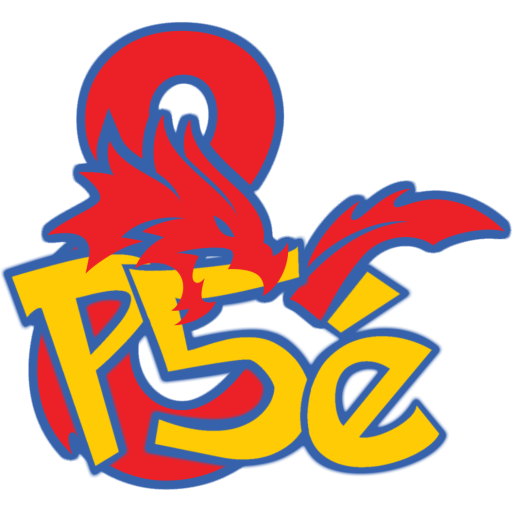

[![Contributors][contributors-shield]][contributors-url]
[![Forks][forks-shield]][forks-url]
[![Stargazers][stars-shield]][stars-url]
[![Issues][issues-shield]][issues-url]

 

  

  <h3 align="center">Pokemon5e Items module for FoundryVtt</h3>

  

    A module for FoundryVtt that provides compendiums containing over 200 items for the Pokemon5e system with limited support for BetterRolls and DynamicEffects.
     
     
    <a href="https://github.com/MajorVictory/Pokemon5e-items/issues">Report Bug / Request Feature</a>
  

**[Compatibility]**: *FoundryVTT* 0.6.5

**[Systems]**: *dnd5e*

## Installation

**No release available yet**

You are welcome to download the repo and test, but as of yet there is no official release of this module.

You can view item progress and usage instructions on [this spreadsheet](https://docs.google.com/spreadsheets/d/1qyvenM4MrTE9GfYi3uIKrCeI8BXrTiRqAwyTv9iNYfE/edit?usp=sharing)

## Features

 * Items with full descriptions, images, and limited automated functionality. (uses DynamicEffects)
 * Rolltables for loyalty, fishing rods (wip), natures, and more.
 * Optional conditions json that can be imported into Combat Utility Belt's Condition Lab complete with custom overlay images.

## Screenshots 

## Contact

MajorVictory87 - Discord: MajorVictory87#3666

Project Link: [https://github.com/MajorVictory/Pokemon5e-items](https://github.com/MajorVictory/Pokemon5e-items)

## License

Pokemon5e Items is a module for Foundry VTT by Majorvictory and is licensed under a [Creative Commons Attribution 4.0 International License](http://creativecommons.org/licenses/by/4.0/).

This work is licensed under Foundry Virtual Tabletop [EULA - Limited License Agreement for module development from May 29, 2020](https://foundryvtt.com/article/license/).

[contributors-shield]: https://img.shields.io/github/contributors/MajorVictory/Pokemon5e-items.svg?style=flat-square
[contributors-url]: https://github.com/MajorVictory/Pokemon5e-items/graphs/contributors
[forks-shield]: https://img.shields.io/github/forks/MajorVictory/Pokemon5e-items.svg?style=flat-square
[forks-url]: https://github.com/MajorVictory/Pokemon5e-items/network/members
[stars-shield]: https://img.shields.io/github/stars/MajorVictory/Pokemon5e-items.svg?style=flat-square
[stars-url]: https://github.com/MajorVictory/Pokemon5e-items/stargazers
[issues-shield]: https://img.shields.io/github/issues/MajorVictory/Pokemon5e-items.svg?style=flat-square
[issues-url]: https://github.com/MajorVictory/Pokemon5e-items/issues
[license-shield]: https://img.shields.io/github/license/MajorVictory/Pokemon5e-items.svg?style=flat-square
[license-url]: https://github.com/MajorVictory/Pokemon5e-items/blob/master/LICENSE.txt
[product-screenshot]: readme/Items-Preview-7-27-2020.png
