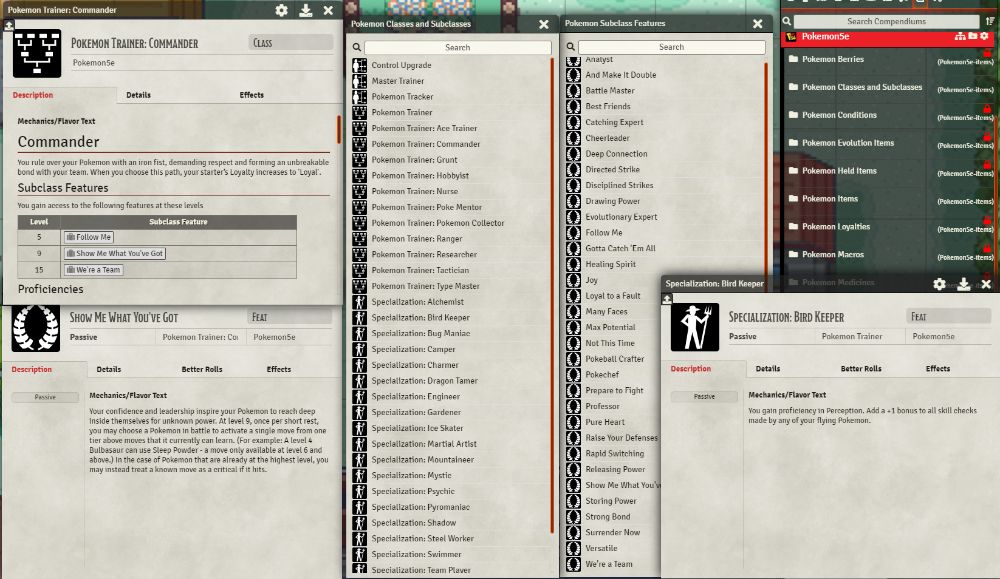
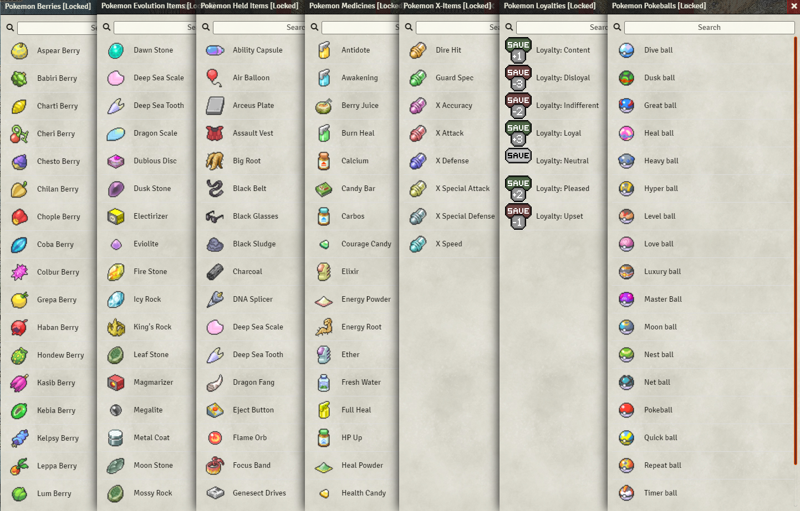
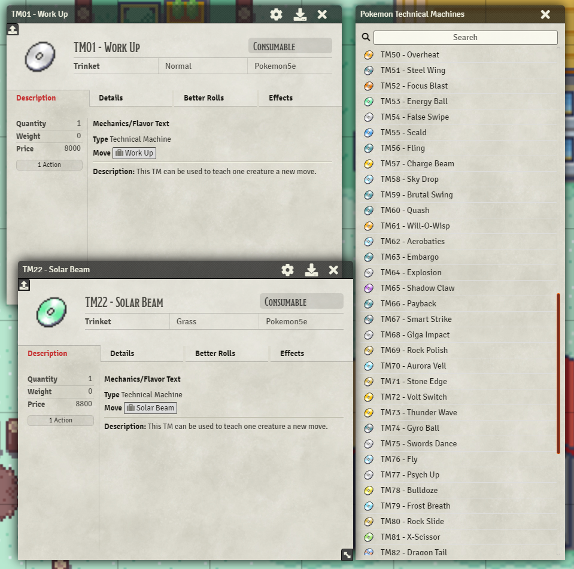
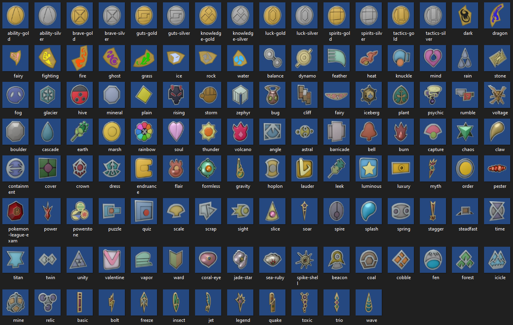
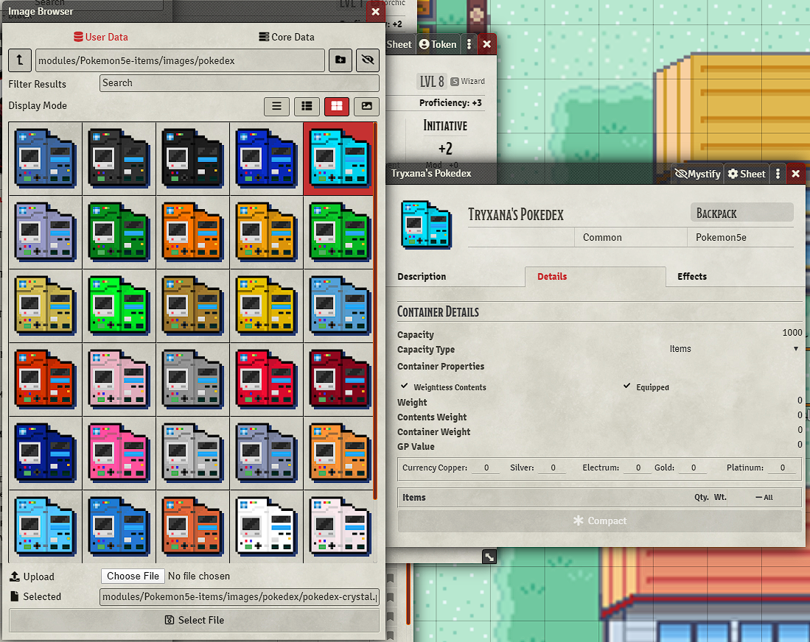
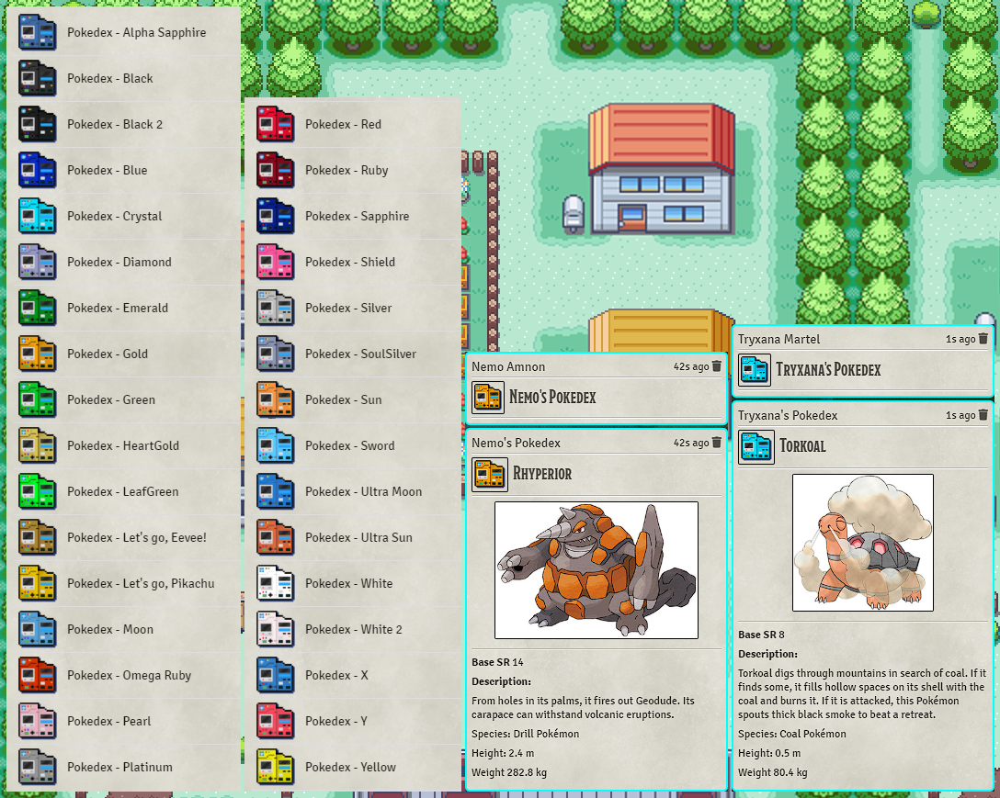
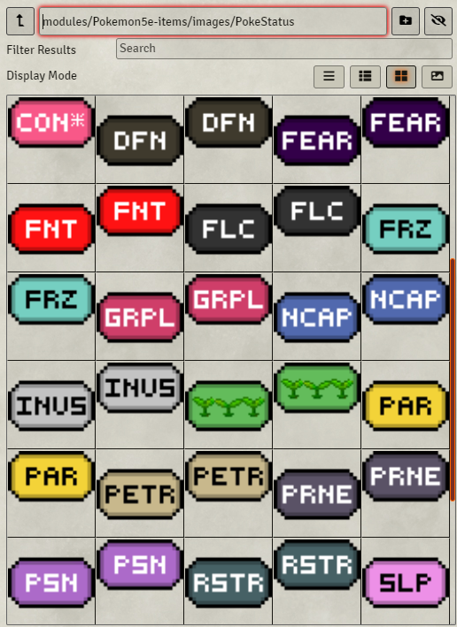
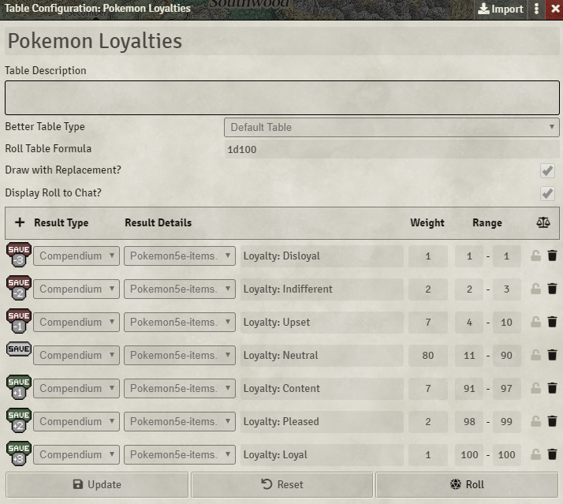
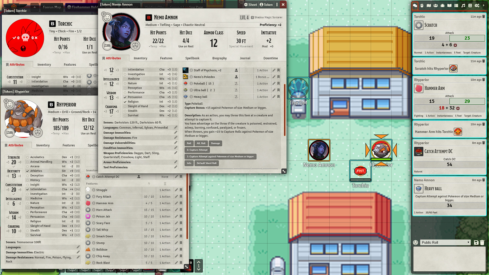

[![foundry-shield]][foundry-url]
[![Forks][forks-shield]][forks-url]
[![Stargazers][stars-shield]][stars-url]
[![Issues][issues-shield]][issues-url]

 

  

  <h3 align="center">Pokemon5e Items module for FoundryVtt</h3>

  

    A module for FoundryVtt that provides compendiums containing over 200 items for the Pokemon5e system with limited support for BetterRolls and DynamicEffects.
     
     
    <a href="https://github.com/MajorVictory/Pokemon5e-items/issues">Report Bug / Request Feature</a>
  

## Installation

### Requirements

**[Compatibility]**: *FoundryVTT* 0.6.6  
**Not yet compatible with 0.7.x**

**[Systems]**: *dnd5e* 0.96

**[Required Modules]**
 * [Jerakin's Pokemon5e Module](https://github.com/Jerakin/p5e-foundryVTT) - moves, abilities, and pokemon compendiums
 * [Dynamic Effects](https://foundryvtt.com/packages/dynamiceffects/) - The majority of stat effects
 * [Better Rolls for 5e](https://foundryvtt.com/packages/betterrolls5e/) - Easier usage of items and alternate rolls
 * [The Furnace](https://foundryvtt.com/packages/furnace/) - enables Pokedex macro usage
 * [Item Collection](https://foundryvtt.com/packages/itemcollection/) - enables Pokedex and backpack items
 
**[Recommended Modules]**
 * [Combat Utility Belt](https://foundryvtt.com/packages/combat-utility-belt/)
 * [Tidy5e Sheet](https://foundryvtt.com/packages/tidy5e-sheet/)

### Latest Release: V1.3.0

You can download the module in it's current state by pasting the following manifest url into Foundry.

> https://raw.githubusercontent.com/MajorVictory/Pokemon5e-items/master/module.json

## Changelog

[Previous Versions Changelog](changelog.md)

## Features

 * Items with full descriptions, images, and limited automated functionality. (uses DynamicEffects)
 * Customizable Pokedex with colors representing each mainline game series and the Pokedex can actually be used to scan creatures!
 * Expands the DnD5e system to include Pokemon5e Damage Types, Conditions, and d20 Hit Dice.
 * Rolltables for loyalty, fishing rods, natures, weather, and more.
 * Optional conditions json that can be imported into Combat Utility Belt's Condition Lab complete with custom overlay images.

You can view [specific item usage instructions on this spreadsheet](https://docs.google.com/spreadsheets/d/1qyvenM4MrTE9GfYi3uIKrCeI8BXrTiRqAwyTv9iNYfE/edit?usp=sharing)

## Done / TODO

Here's an overview of what's 'done'

✔️ Indicates finished ready to use (hopefully)  
❌ Indicates present, but not ready for use  

 * ✔️ Classes and Subclasses
 * ✔️ Subclass Features and Specialties
 * ✔️ All Official TV Series badges
 * ✔️ Semi-Official Homebrew Badges
 * ✔️ Pokeballs
 * ✔️ Berries
 * ✔️ Medicines
 * ✔️ X-Items
 * ✔️ Held Items
 * ✔️ Evolution Items
 * ✔️ Mundane Items (needs more in-style icons, but considered finished)
 * ✔️ Special Items
 * ✔️ Rolltables for fishing rods
 * ✔️ Rolltables for weather
 * ✔️ Rolltables for habitat encounters
 * ❌ Other Rolltables? ([suggestions welcome](https://github.com/MajorVictory/Pokemon5e-items/issues))

## Screenshots 

### Classes, Subclasses, Subclass Features, and Specialties 

### Items

Mundane items, berries, medicines, held items, evolution items, TMs, and more...

Badges for every region and an extra 40+ "Homebrew Badges" shown but not named by the TV series. Names have been provided, but you are welcome to change them to suit your own campaigns.

### Customizable Pokedex

### Conditions and Loyalties

### Poor Torchic!

## Contact

MajorVictory87 - Discord: MajorVictory87#3666

Project Link: [https://github.com/MajorVictory/Pokemon5e-items](https://github.com/MajorVictory/Pokemon5e-items)

## Attributions

### [Pokésprite](https://msikma.github.io/pokesprite/) - **MIT License**

### [Pokédex Icon - Red](https://icon-library.com/icon/pokedex-icon-28.html) - **CC0 Public Domain Licence**

### [Badge Icons](https://www.deviantart.com/seancantrell/art/All-Pokemon-Badges-399596702) - [Sean Cantrell](https://www.deviantart.com/seancantrell)

### Status Markers - Discord: *Doctor Deadderth#4739* 

### Custom Art by me (MajorVictory):

 * Weather icons Inspired by Pokémon Sword and Shield weather icons.
 * Pokédex icons (all but original red color)
 * Polkadot Bow
 * Many DnD Status icons

## License

The pokesprite sprite images are © Nintendo/Creatures Inc./GAME FREAK Inc.

Pokemon5e Items is a module for Foundry VTT by Majorvictory and is licensed under a [Creative Commons Attribution 4.0 International License](http://creativecommons.org/licenses/by/4.0/).

This work is licensed under Foundry Virtual Tabletop [EULA - Limited License Agreement for module development from May 29, 2020](https://foundryvtt.com/article/license/).

[foundry-shield]: https://img.shields.io/badge/Foundry-v0.6.5-informational
[foundry-url]: https://foundryvtt.com/
[forks-shield]: https://img.shields.io/github/forks/MajorVictory/Pokemon5e-items.svg?style=flat-square
[forks-url]: https://github.com/MajorVictory/Pokemon5e-items/network/members
[stars-shield]: https://img.shields.io/github/stars/MajorVictory/Pokemon5e-items.svg?style=flat-square
[stars-url]: https://github.com/MajorVictory/Pokemon5e-items/stargazers
[issues-shield]: https://img.shields.io/github/issues/MajorVictory/Pokemon5e-items.svg?style=flat-square
[issues-url]: https://github.com/MajorVictory/Pokemon5e-items/issues
